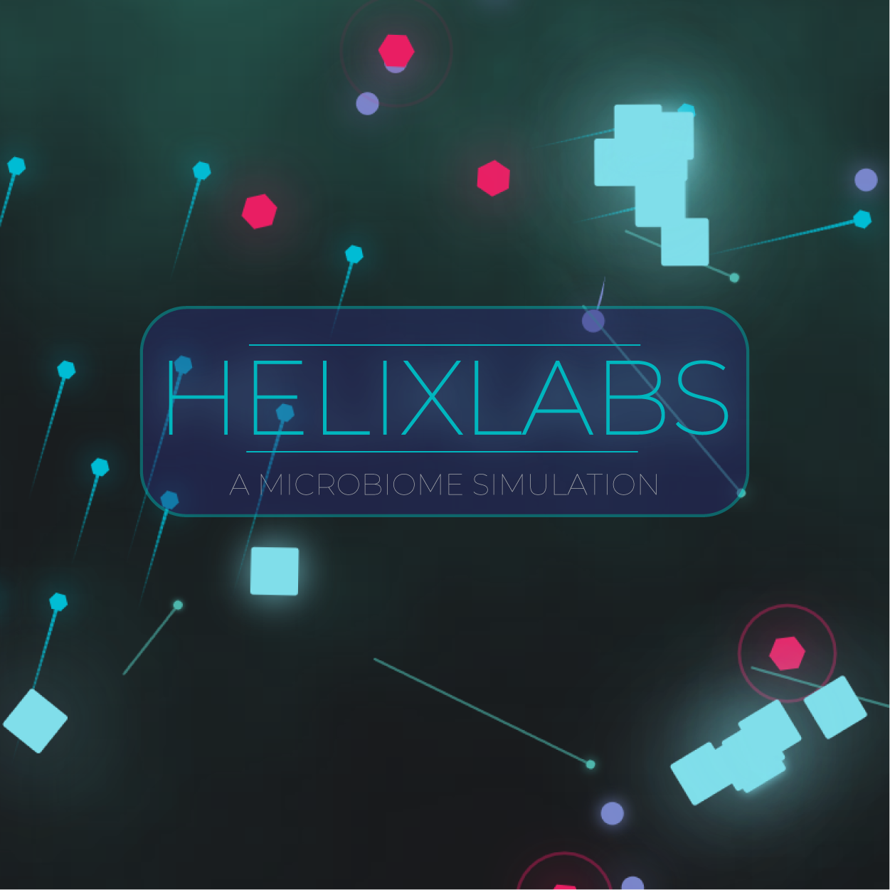
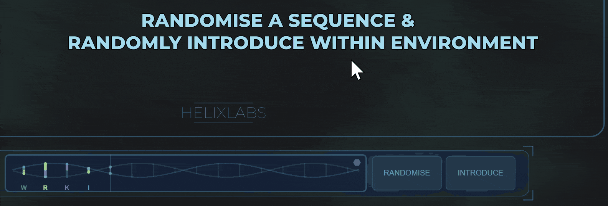
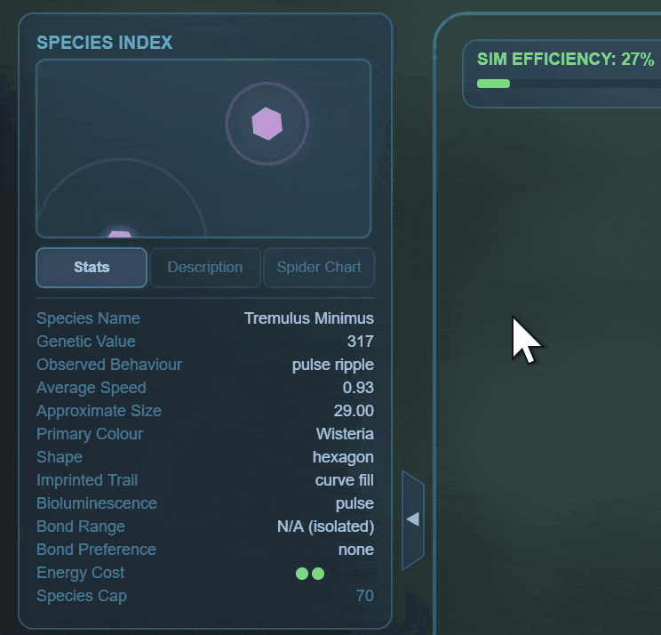
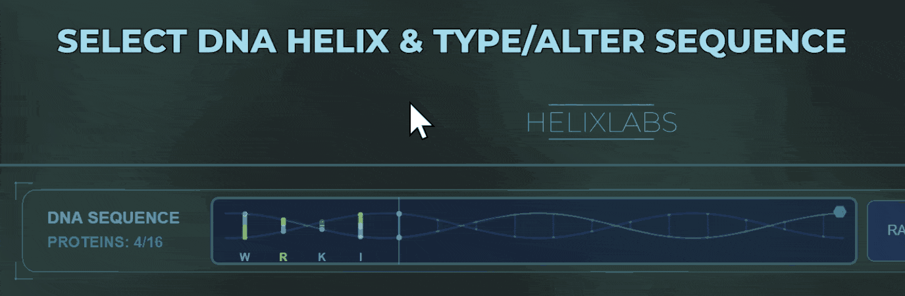
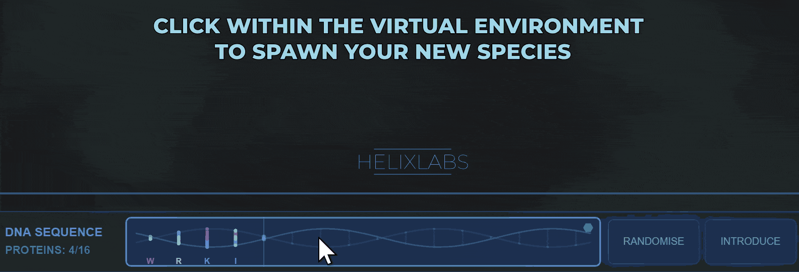
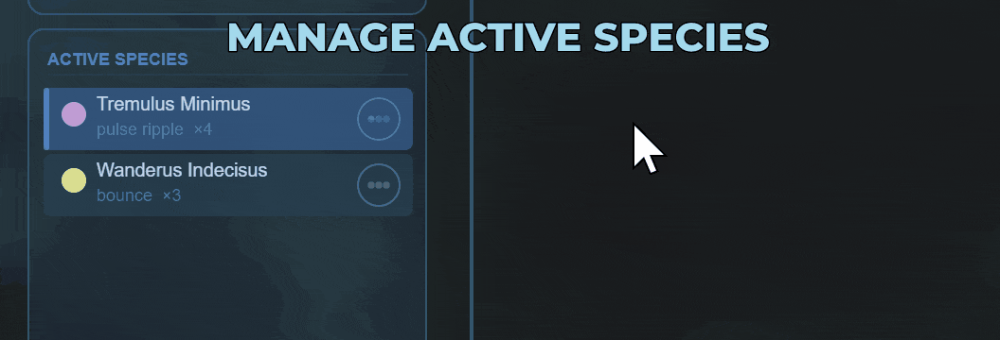

<div align="center">



# HELIXLABS - A Microbiome Simulation

**An interactive microbiome simulation built with p5.js. Synthesise alien life forms, introduce them into a living ecosystem, and observe each species' behaviour unfold in real time.**

[](https://braydenh563.github.io/HELIXLABS/)
[](https://github.com/Braydenh563/HELIXLABS/releases)
[](LICENSE)

[](https://github.com/Braydenh563/HELIXLABS/actions/workflows/deploy.yml)
[](https://github.com/Braydenh563/HELIXLABS/actions/workflows/lint.yml)

</div>

---

## Overview
HELIXLABS is a creative coding project developed in JavaScript using the **p5.js** library. Users craft unique microorganisms by sequencing alien base proteins, then release them into a simulated petri-dish environment. Each species exhibits distinct behaviours - competing, coexisting, and evolving within the simulation.

Originally developed for the QUT **DXB211** (Creative Coding) final assessment, the project will be showcased at the Queensland Games Festival (June, 2026), as well as a **public exhibition at The Lanes, Fortitude Valley, Brisbane, Australia (July 2026)**.

---

## Access & Compatibility
> **Note:** HELIXLABS is currently playable on **PC/Laptop (Windows & Linux)** only. MacOS is not currently supported.

| Platform | Link |
|---|---|
| Live Web Version | [braydenh563.github.io/HELIXLABS](https://braydenh563.github.io/HELIXLABS/) |
| Latest Release (v1.1.0) | [Download for Windows & Linux](https://github.com/Braydenh563/HELIXLABS/releases/tag/v1.1.0) |
| p5.js Web Editor Preview | [Open in Editor](https://editor.p5js.org/braydenh563/full/kBas-ftqq) |

---

## Showcase

### Core Gameplay - Randomise & Introduce Controls


### Species Index


### Tutorial Walkthrough




---

## Features
- **Procedural Species Generation** - 26 alien base proteins combine to produce unique organisms with distinct traits and behaviours using instances of `NodeClass.js`
- **Real-Time Ecosystem Simulation** - organisms interact, compete, and coexist dynamically within the environment
- **Emergent Behaviour System** - species behaviour arises organically from their DNA sequence, not hardcoded rules
- **Ambient Audio Engine** - a custom `BackgroundAmbienceManager` dynamically layers sound based on simulation state (uses royalty free music)
- **Species Index UI** - an in-simulation encyclopedia cataloguing every species you have introduced
- **Tutorial System** - a built-in guided walkthrough for first-time players
- **FPS Performance Indicator** - real-time performance monitoring overlay
- **Randomise Mode** - instantly generate a surprise DNA sequence for quick experimentation
- **Click & Drag Interaction** - physically move individual organisms around the environment
- **Notification System** - custom in-simulation notifications via `Notification.js`

### Creative Influences
 - Make Your Own Pen Shapes v1.7 - (dllyd, 2018)
   - Link: https://scratch.mit.edu/projects/89132897 
 - Glassmorphism - Michal Malewicz (Malewicz, 2026) & the Jarvis HUD – Jayse Hansen (2008)
   - Link: https://uxdesign.cc/glassmorphism-in-user-interfaces-1f39bb1308c9 
 - Boids - Craig Reynolds (Reynolds, 2001)
   - Link: https://www.red3d.com/cwr/boids/ 

---

## Controls
| Input | Action |
|---|---|
| **Type letters (A–Z)** | Define and craft your DNA helix/sequence |
| **Click environment** | Spawn and introduce your new species |
| **Click & drag** | Move individual organisms |
| **Randomise button** | Generate a surprise sequence |
| **Trackpad / scroll** | Navigate and interact with the environment |

---

## Project Structure
```
HELIXLABS/
├── index.html                        # Entry point
├── style.css                         # Styling
├── sketch.js                         # Core simulation loop & logic
├── NodeClass.js                      # Species/organism node system
├── BackgroundAmbienceManager.js      # Dynamic ambient audio engine
├── Notification.js                   # In-simulation notification system
├── gifs/                             # Showcase GIFs
├── sounds/                           # Audio assets
├── fonts/                            # Custom fonts
├── metadata/                         # Thumbnail & metadata assets
└└── .github/workflows/               # CI/CD GitHub Actions
```

---

## Technical Details
| Detail | Info |
|---|---|
| **Primary Language** | JavaScript (99.9%) |
| **Libraries** | p5.js, p5.sound.min.js |
| **Deployment** | GitHub Pages (auto-deploy via GitHub Actions) |
| **License** | MIT |

---

## About the Developer
Created by **Brayden Hoyle**, a Computer Science & Interaction Design student at **Queensland University of Technology (QUT)**, Brisbane, Australia.

- GitHub: [@Braydenh563](https://github.com/Braydenh563)

---

## License
This project is licensed under the [MIT License](LICENSE).
